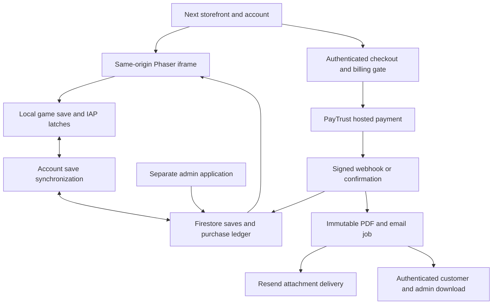

# Commerce implementation and project map — 5 October 2026

## Source and deployment baseline

The game checkout at this document's parent is the Phaser/Vite application from https://github.com/novativeai/emberkeep-game.git. It was fast-forwarded to `567c446edd10795d13e497338def9a60bee0b83b` before making changes. The independently versioned `embergames/` Next.js storefront was fast-forwarded to `350db280bd42f645e756f91315f9ea17c6fbe006` from https://github.com/novativeai/embergames.git. Both repositories retain a `backup/before-live-sync-20261005` branch.

https://keepofthedragon.com is attached to the **Ember** Vercel project (`prj_LpX8Ke7mgNechBvyOzXoHwbFL2Hx`, team `ember-7d69`). The production deployment inspected before these edits was `dpl_Cm7Pr32WnPJEV3DQ1Bk4ZPqfWzUV`, https://ember-3t139nfk7-ember-7d69.vercel.app. Its served game JavaScript matched the baseline rebuilt game. The user authorized publishing the verified changes on 5 October 2026. Release deployment results are recorded in `testcapture/commerce/release.json`.

`embergames-admin/` is a separate Next.js application, locally linked to Vercel project `embergames-admin`, in a different team. The admin production deployment inspected was `dpl_6wAabj8BpNHw2uQErzcLD62jKeLL`, https://embergames-admin-bnpl2c8j7-novativeais-projects.vercel.app, with no Git commit metadata in the project response. It was an untracked directory without its own Git repository at assessment. The authorized release versions it in a separate private repository at https://github.com/novativeai/embergames-admin; the parent ignores this nested checkout. All three repositories must be pushed for a full release.

## Where each component lives

| Component | Source | Connection |
| --- | --- | --- |
| Landing page | `embergames/src/app/games/emberkeep/page.tsx` | Next rewrites `/` to this page; contains the game invitation and website shop. |
| Account | `embergames/src/app/account/page.tsx` | Firebase Auth identity, three player stat tiles, settings, purchases, embedded game. |
| Game wrapper | `embergames/src/components/GamePlayer.tsx` | Mounts the same-origin `/games/emberkeep/index.html` iframe after save/session readiness. |
| Running game | parent `src/`, build `dist/` | Phaser scenes, typed event bus, gameplay systems and local `emberkeep_save`. |
| Served game | `embergames/public/games/emberkeep/` | Committed copy of the game build; Vercel can deploy the storefront without the parent game source. |
| Build integration | `embergames/scripts/sync-game.mjs`, `dev-all.mjs` | Both now default to the synchronized parent checkout; `EMBERKEEP_GAME_ROOT` overrides it. `sync:game --from-build` copies a verified build and stamps its update time. |
| Auth/save bridge | storefront `AuthProvider.tsx`, `saveSync.ts`, `session.ts`, `proxy.ts` | Firebase token, signed play-session cookie, local/cloud restore, iframe reload after an admin reset/restore. |
| Commerce backend | storefront `src/app/api/iap/`, `src/lib/server/` | Authenticated checkout, PayTrust redirect, signed webhook, confirmation fallback, settlement and invoices. |
| Admin | `embergames-admin/src/app/(admin)/` | Separate admin session; Firebase Admin reads the same Auth/Firestore data. Player details, save snapshots, reset, purchases and invoices. |
| Shared invoice code | `scripts/sync-commerce.mjs` | Mirrors invoice/profile/font modules into the independently deployed admin app. `--check` verifies byte parity and seller consistency with the site's legal identity. |

The game and storefront must share an origin: the iframe bridge posts to the game's own origin, and the host validates both origin and iframe source. `pnpm all` proxies the Vite game through the storefront in development. A plain `pnpm dev` serves the committed game build.

## Game and admin boundaries

`src/main.ts` creates `GameContext` and makes it available to scenes through the Phaser registry. Boot/Preload load runtime art, Title enters the board, BoardScene renders/interacts with the island, and UIScene owns HUD/panels/checkout feedback. `src/core/GameState.ts` owns gameplay state. Systems mutate it through the typed synchronous `EventBus` contract in `src/core/types.ts`; UI emits intents rather than changing currency directly.

Gold/XP come through EconomySystem, Warmth through EnergySystem, and paid grants through IapSystem. SaveSystem serializes the shared state and purchase latches to `emberkeep_save`. `src/core/iapBridge.ts` receives the storefront catalog and paid grant, while `src/core/coinPacks.ts` handles live versus standalone offers. `src/ui/ShopPanel.ts` renders the Emporium. Game tuning and authored content live in `src/core/Constants.ts` and `src/data/`; the storefront/admin read models now match the game's six Keeper XP thresholds.

The backoffice reads Firebase Auth metadata separately from Firestore game state. `/players` joins identity, billing profile, progress, purchases, sessions and snapshots; `/activity` shows tracking events; `/purchases` aggregates the purchase ledger; `/board` reads the existing shared task board; `/admins` manages administrator accounts; `/commerce` configures invoice seller/sender details and displays queue health. These pages use server credentials and `requireAdmin`, not the player Firebase token. The task board is an independent service at https://emberkeep-board.vercel.app.

## Purchase flow

1. The website shop or the Emporium requests a preset pack or `custom_gold`.
2. Custom amounts are validated as integer euro cents, €5.00–€1,000.00 inclusive, maximum two decimal places. **One cent buys one Gold:** €760.16 buys 76,016 Gold. Preset products and their existing bonuses remain available; custom amounts use the flat rate.
3. `POST /api/iap/checkout` verifies a real Firebase account and every required profile field. Missing details return `428 PROFILE_REQUIRED`, create no purchase, and open billing settings. The game stays mounted when settings open on the account page.
4. `PUT /api/account/profile` validates names, calendar date of birth, account email, international phone, ISO country, city, address and postal code. A transaction generates one stable random 32-character customer reference. Browsers cannot select or overwrite it.
5. Checkout snapshots the billing profile, authoritative price and grant into `users/{uid}/purchases/{id}`. It generates a separate payment reference in `paytrust_references/{ref}` and creates the hosted PayTrust payment.
6. The HMAC-signed webhook and authenticated confirmation fallback use one Firestore transaction. The payment identity, EUR currency and exact cents must agree. Replayed events do not double settle; refunds/chargebacks remain terminal.
7. The game's `iap:<purchaseId>` save latch makes delivery idempotent. Saving that latch/Gold and marking the purchase granted now commit atomically. Older same-generation autosaves cannot overwrite a newer saved timestamp. A failed save leaves the purchase unacknowledged for retry.
8. Settlement queues an invoice independently of Gold delivery. A PDF snapshots seller and buyer facts once; both admin and customer download the same stored document. Date of birth and phone are not printed on the invoice. Historical purchases explicitly say that their billing address was not recorded; current addresses are not backdated.
9. Resend sends the attached PDF using an invoice-specific idempotency key. A Firestore lease and durable job record protect concurrent callbacks/retries. Missing configuration leaves the download usable and the email queued as `unconfigured`. Uncertain send attempts older than 23 hours enter `review`, to avoid blindly resending after Resend's 24-hour idempotency retention.

## Firestore records and ownership

| Record | Ownership/use |
| --- | --- |
| `saves/{uid}` | Owner reads/writes valid save blobs; server controls `generation`. Client deletion is denied. |
| `saves/{uid}/snapshots/{id}` | Server-created recovery points, including pre-reset/pre-restore backups. |
| `users/{uid}.billingProfile` | Owner reads; authenticated server endpoint validates/writes. |
| `users/{uid}/purchases/{id}` | Server creates/settles money and grants; owner reads and may acknowledge once. |
| `users/{uid}/invoices/{id}` | Server-only immutable PDF and delivery status; served through authenticated download routes. |
| `invoice_jobs/{hash}` | Server-only retry schedule for settled purchases. |
| `commerce_settings/invoices` | Admin-managed seller and verified sender settings. |
| `paytrust_references/{ref}` | Server-only payment-to-user/purchase lookup. |
| `processed_webhooks/{bodyHash}` | Server-only signed-event deduplication. |
| `admin_users`, admin session | Separate administrator authentication and access controls. |

Player progress shows only **Level, XP and Gold balance**. Member dates, last sign-in, cloud/save diagnostics and reset controls are in the admin panel. Reset keeps a recovery snapshot, acknowledges already-latched grants, increments the save generation, and reloads an active player's game. Old clients cannot overwrite the reset.

## Remaining production configuration and verification

The Ember production environment inspected had **no Resend API key or sender configured**. The user explicitly deferred Resend setup and authorized publishing the verified code with invoice delivery queued until configuration is supplied. No working Ember-specific key was found locally. Unrelated applications' credentials were not copied into this project.

Production release configuration:

1. Configure `RESEND_API_KEY`, a sender verified for this business (`RESEND_FROM_EMAIL` or the admin Invoices settings), and a strong `CRON_SECRET` in the **Ember** project. The release generates/configures CRON_SECRET separately; Resend credentials remain deferred. Seller defaults are the existing site's LUNQEST LIMITED legal identity and company number 16823938; optional `INVOICE_SELLER_*` overrides exist.
2. Confirm PayTrust's actual merchant API contract for the new `customer.dateOfBirth`, `customer.phone`, `customer.referenceId` and `billing.{country,city,addressLine,postalCode}` fields. The feedback specifies the required facts but did not provide the API document. The existing successful payment schema was inspected read-only; the new billing payload has been tested against an isolated simulator, **not verified against a merchant sandbox contract**. No real payment was created.
3. Publish the validated `embergames/firestore.rules` before exposing the admin reset/restore changes. Deploy matching game, storefront and admin code together; old clients without the new generation protocol will be refused after a reset.
4. Set the canonical return/webhook origin to https://keepofthedragon.com with `PUBLIC_BASE_URL`/`NEXT_PUBLIC_SITE_URL`; retain the existing production PayTrust keys and cookie secret.
5. The team's plan was verified as Pro via Vercel's team API. The configured hourly invoice cron is compatible with that plan. Hobby permits only daily cron and would reject this schedule: https://vercel.com/docs/cron-jobs/usage-and-pricing.
6. Once credentials and the provider schema are confirmed, verify one authorized sandbox payment and invoice email before the production rollout. Resend attachment API reference: https://resend.com/docs/api-reference/emails/send-email. No invoice email or live purchase was sent during this implementation.
7. For an invoice in `review`, check Resend delivery logs before requeueing it. This state deliberately stops automatic attempts rather than risk duplicate mail.

## Local verification

Use Node 22. Run the parent game typecheck, unit tests and build; run storefront typecheck/unit tests/build and admin typecheck/build; run `node scripts/sync-commerce.mjs --check` from the parent. Firestore rules tests run against project `demo-ember-commerce` on port 8185 with `vitest.rules.config.mts`.

The explicitly authorized limited browser harness is `embergames/tests/browser/commerce.mjs`. Its service launcher uses only demo Firebase emulators and a local payment simulator; it does not send emails. Screenshots, a downloaded PDF and a structured report are written under `testcapture/commerce/`. The harness closes its browser in `finally`. Do not run browser checks without the authorization required by CLAUDE.md.

Verified results: game 86 unit-test files / 1,191 tests and typecheck/build; storefront 65 unit tests; Firestore emulator 6 rule tests; authorized browser harness 23 checks with no captured browser/game runtime errors; admin typecheck; changed commerce source ESLint checks; shared module parity. The downloaded browser invoice was rendered with Poppler and visually inspected. Final production-build results are recorded in `testcapture/commerce/verification.json`.

Playwright's default screenshot option temporarily applies `caret-color: transparent` to all inputs. Capturing a streamed admin page before its final React boundaries hydrate caused a test-induced attribute mismatch warning. The harness now sets `caret: 'initial'` on screenshots so it does not mutate those attributes; application runtime error arrays were empty.

Task board: https://emberkeep-board.vercel.app — EMB-331 closes local implementation/QA; EMB-332 retains production configuration and gateway verification in review.
