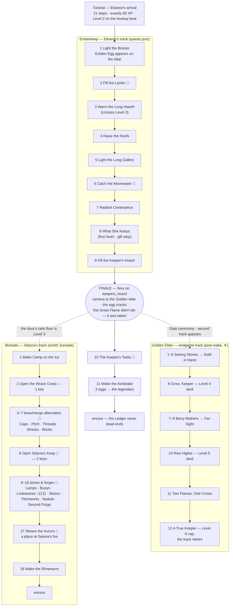
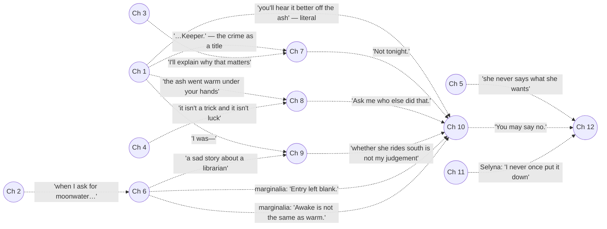

# Story map — tracking and visualizing everything narrative

> **Status: TRACKING LAYER.** This doc is the single place to *see* the whole
> story system — the canon in one page, the reveal ladder, the event
> successions as shipped and as written, the merge-item lore index, and the
> wired-vs-canon drift board. It is authoritative for **exactly one thing: the
> drift board in §9** (what is wired, what is spec, what diverges). For
> everything else it is a map, and the territory always wins — §1 says which
> file wins each argument.
>
> Keep it fresh: whenever story, quests, dialogue or chains change, update §9
> (and any diagram the change touches), then run the story-qa skill's
> mechanical pass — `python3 .claude/skills/story-qa/scripts/coherence.py`.

---

## 1. Source-of-truth map — who owns what

| File | Authoritative for | State |
| --- | --- | --- |
| [story-bible.md](story-bible.md) | canon, the reveal ladder, cast, voice rules, the proper-noun budget | CANON — wiring begun |
| [quests.md](quests.md) | the campaign quest per chapter, coherence contracts, the **promise ledger** | SPEC COMPLETE |
| [script-chapters.md](script-chapters.md) | every campaign line: 12 chapters + 8 recurring banks | SCRIPT COMPLETE, register-passed (8–13) — ch 2 + banter banks wired |
| [opening-scene.md](opening-scene.md) | chapter 1, Eleanor's arrival | WIRED (the tutorial opening) |
| [conversation-staging.md](conversation-staging.md) | faces, portraits, bubble staging | SPEC |
| [merge-chains.md](merge-chains.md) | the economy every requirement must be reachable in; chain lore rationale | LARGELY SHIPPED |
| [quest-ladder.md](quest-ladder.md) | the SHIPPED HUD ladder + the `pnpm quests` reachability proof | SHIPPED truth |
| [GDD-L1.md](GDD-L1.md) | the shipped Chapter One mirror of Constants.ts + data | SHIPPED (pre-north; aging) |
| [world-characters.md](world-characters.md) | Eleanor/Selyna as map standees | SPEC |
| [naming.md](naming.md) | player-facing display names — the kid-clarity (8–13) old→new map and dialogue register rules | SPEC — wire display strings |
| `src/data/*.json` + `src/systems/StorySystem.ts` | what actually fires | THE BUILD |
| **this file** | the drift board (§9) and the visual maps | TRACKER |

The relationship between the two quest worlds in this doc: the **shipped
ladder** (§4) is what a player experiences today; the **canon campaign** (§5)
is being wired *into* that build one gate at a time through `StorySystem` —
not replacing it wholesale. Chapter 2's gate is live; gates 3+ land with the
systems they read (Cold Nest, Trust, Growth).

## 2. The story on one page

Sixty years ago **Silas** — the Moonhold's librarian, married into the
Daughters of the Moon, no magic in him at all — watched his daughter
**Eleanor** perform her final rite on the altar at Emberkeep. The rite was
called **the Keeping**: her craft can *catch* a thing, *hold* it, and *give it
back* — nothing else. She caught the **Great Flame** and sealed it in a vessel,
**the Lantern**, believing entirely that they would return it at dawn. Her
father took the Lantern and left. He had spent his life reading every account
of loss the Hold owned, looking for one case of something taken that was given
back; his theft was grief rehearsing a proof, not villainy.

The dragons did not die — they went cold and went to sleep, and the isle went
to ash. Nobody could wake them, because **the Flame answers a Keeper's hands**:
there was a line of people who tended the sanctuary, and it never stopped
knowing them. Giving back is not craft, and no amount of skill substitutes.

**Now:** Silas is gone. **Selyna** — the younger sister, too young to have been
at the rite — recovered the Lantern and has kept the Flame alive in the
Borealis cold for decades; her craft *preserves* where Eleanor's *returns*.
The Borealis dragons are awake because they followed the Flame north. **The
player is the last of the Keeper line and does not know it.** Eleanor spent
sixty years looking for them — not a helper, the only thing alive that can undo
what she did — and found them before she ever introduced herself.

**The engine:** Silas found someone with a power he didn't have and used her
without telling her all of it. Eleanor found someone with a power *they don't
know they have* and is doing the same — and she knows it. Her turn (ch 10) is
breaking that pattern on purpose: the whole truth, unasked, before the last
request. Selyna's refusal has a condition, not a price (ch 12): Eleanor says
aloud, in front of the dragons and the Keeper, what she did — because a thing
given back by someone who won't name the taking is not given back.

The one shipped line that is load-bearing canon and must never change:
the Golden Elder's ***"the Great Flame didn't die — it was taken."***

## 3. Cast tracker

| Character | Role | Voice — always / never | Lines live in (wired) | Canon-only channels |
| --- | --- | --- | --- | --- |
| **Eleanor** | guide, quest giver, the perpetrator | plain about rules, oblique about herself; her tic: starts something true, hears it, substitutes (≈1/chapter) / never states a falsehood (one flagged exception, ch 4), never grovels | tutorial + hints, `orderComplete` banks 1–6, `chapters.2`, `regard.eleanor` | day-phase lines, Book marginalia, naming, Trust milestones |
| **Selyna** | the antagonist-who-isn't, in the north | clipped, precise, unsentimental / never gloats, never a villain, **never appears in Emberkeep** — world 1 knows her only as handwriting | Borealis orders + `regard.selyna`, `arrivals.borealis` | letters L1–L5 (world 1), ch 11–12 beats |
| **Golden Elder** | sole living witness; silent until she wakes | testifies; the only register allowed capitals / never accuses, never explains a system, never appears before she wakes | `finaleElder`, `elder` (greeting · per-quest · allDone), `goldenEgg` | ch 9 testimony, ~4 post-wake communing lines |
| **The Keeper** | the player; the last of the line | silent, always — Eleanor and Selyna voice their questions / never given a line, ever | — | — |
| **Dragons** | animals with preferences | behave as animals / never understand the plot (the Elder is a person, not a dragon rule) | `eggGift`, hints | Dragon Book entries |

## 4. Event succession — as SHIPPED

What a player actually walks through today. 🥚 = a legendary egg is paid;
🍲 = a cauldron brew through the Rune Way.

Rhythm rules the shipped ladders obey (audit-enforced, [quest-ladder.md](quest-ladder.md) §2):
Emberkeep ping-pongs **by tier** (T1·T3·T2·T3… — never two deep merges in a
row) and **by chain** (no two consecutive quests on one chain); Borealis
ping-pongs **by verb** (merge · brew, never two brews back to back); legendary
eggs sit at completable indices 1/5/9 south and on the marked quests north,
last egg always second-to-last. Quest titles and Ledger order titles are the
same words, always.

## 5. Event succession — the campaign as WRITTEN

The canon 12 chapters ([quests.md](quests.md) §3–4, lines in
[script-chapters.md](script-chapters.md)). Every beat fires on the quest that
made its assumptions true — never on a timer.

```mermaid
flowchart TB
  C1["Ch 1 — First Warmth (tutorial)<br/>rung: something overruled her spell — 'I was—'"]
  C2["Ch 2 — The Cold Fire Bowl (order)<br/>2× Berry Jam to the FIRE BOWL, not to her<br/>rung: catch, hold, return"]
  C3["Ch 3 — The Cold Nest (nest)<br/>9 pts, ≤3/day, ends in a NAMING<br/>rung: they slept; names were never taken"]
  C4["Ch 4 — The Second Terrace (restore)<br/>she fails the Dead Ember first, the player lights it<br/>rung: she cannot wake; the player can"]
  C5["Ch 5 — What It Likes (care)<br/>find the favourite → Trust 2 · letter L1<br/>rung: a sister, and she is hostile"]
  C6["Ch 6 — Five Pages (care)<br/>5 Dragon Book entries<br/>rung: her father, the librarian"]
  C7["Ch 7 — The Second Nest (nest)<br/>gates on NAMED == 2, never hatched<br/>rung: the rite was called the Keeping"]
  C8["Ch 8 — The Third Gate (restore)<br/>Crystal Ball → key · the Long Hearth lit<br/>rung: it was never luck — she went looking"]
  C9["Ch 9 — The Golden Altar (care+order)<br/>ONE ADULT dragon — 5 well-fed days<br/>rung: the Elder wakes and testifies"]
  C10["Ch 10 — Pack for the Trip (order)<br/>everything fed, ledger closed<br/>rung: the whole truth, unasked"]
  C11["Ch 11 — Find the Last Page (order)<br/>search the Hold's records<br/>rung: Selyna has the Lantern"]
  C12["Ch 12 — Her Dragons (care)<br/>Selyna Regard 3 by caring for HER dragons<br/>rung: her terms — Eleanor names the taking"]

  C1 --> C2 --> C3 --> C4 --> C5 --> C6 --> C7 --> C8 --> C9
  C9 ==>|"the journey SOUTH — beats fire on arrival at the Hold"| C10
  C10 ==>|"the NORTH opens"| C11 --> C12
```

Floor ~25 days: the two Cold Nests and the five well-fed days are hard
multi-session gates no stockpile compresses. **Nothing gating a chapter is
purchasable**, no quest consumes a keepsake, and the withheld thing is always
the next rung — never a random secret.

### 5.1 The promise arcs, visualized

Setup → payoff across chapters. The authoritative row-by-row table (verbatim
lines, both directions checked) is [quests.md](quests.md) §5 — this is the
shape of it. A promise with no payoff is a bug; a payoff with no setup is worse.

Chapter 10 is where four separate promises converge — it is the hinge, and any
reordering around it must re-check every inbound arc.

## 6. Merge item lore index

One line of lore per chain — why each thing exists in the fiction. Full
economics (rates, tiers, recipient locks) live in
[merge-chains.md](merge-chains.md); this is the meaning layer. Recipient locks
are absolute: dragon food never goes to a mage, **nothing of Eleanor's or
Selyna's is ever food**.

### Emberkeep — Layer A, the farms you grow (T3 is the producer)

| Chain | Ladder | Lore | State |
| --- | --- | --- | --- |
| `emberberry_plant` | Sprout → Bush → **Ripe Plant** | the first thing replanted in the ash — sugar for furnaces with heartbeats | shipped |
| `firepine` | Seedling → Sapling → **Firepine** | slow pitch from a tree that survives fire by feeding it | hidden until the nest chapter |
| `cinder_vein` | Cracked Stone → Cinder Seam → **Cinder Vein** | quartz crystallised in the cooled veins of the old fire | spec |
| `dew_basin` | Hollow Stone → Dew Hollow → **Dew Basin** | catches what the night gives back — runs **night only** | spec |
| `lumber` | Cut Wood → Plank Set → **House** → **Manor** | roofs raised again; the gold loop | shipped |
| `emberbark` | single fixture, the **Emberbark Stump** | the first tree the fire took, dressing itself in moss again — the tutorial's opening image | shipped |

### Emberkeep — Layer B, the goods you spend

| Chain | Ladder | Lore | Recipient |
| --- | --- | --- | --- |
| `emberberry` | Emberberry → Basket → **Preserve** | sugar burns hot and fast — quick fuel | dragons |
| `resin` | Resin Bead → Resin Lump → **Hearth Cake** | pitch burns slow — the feast fuel | dragons |
| `ashmoss` | Moss Tuft → Moss Bundle → **Green Bale** | a furnace that never cools cooks itself — the cooling green | dragons |
| `stormcap` | Storm Cap → Cap Cluster → **Charged Cap** | fruits where lightning struck — fuel that crackles | dragons |
| `nightbloom` | Night Bud → Night Bloom → **Cooling Wreath** | opens after dark — the second green; the board's only item with a hole through it | dragons |
| `quartz` | Quartz Pebble → Cut Crystal → **Crystal Ball** | Eleanor catches light and **holds it in glass** — her verbs, made solid | Eleanor, all tiers |
| `moonwater` | Dew Drop → Dew Vial → **Moonwater** | light the night gave back, caught before dawn | Eleanor, all tiers |

### Borealis — the made objects (nothing grows here; the sea gives things back)

The north's premise in one sentence: *everything worth having is something
people brought and lost.* Five farm lanes (fixture chain builds **the
machine**, product chain is what it makes; every twelfth production seeds the
next machine's parts) plus five compass-wave generators.

| Lane / chain | Machine · Icon | Lore |
| --- | --- | --- |
| glasswork | Fire Brick → Kiln Grate → **Glass Kiln** · Glass Float → Glass Buoy → **Bottled Ship** | the sea's glass re-melted; the ship in the bottle is the voyage that didn't make it |
| starwright | Brass Cog → Gear Ring → **Starwright's Bench** · Ground Lens → Spyglass → **Orrery** | instruments of the people who navigated here — the sky was their map home |
| wreckforge | Iron Billet → Forge Bellows → **Wreck Forge** · Iron Cap → Banded Helm → **Horned Helm** | wreck-iron reforged; armour for a cold that fights back |
| tarkiln | Tar Spile → Tar Bucket → **Tar Kiln** · Pitch Bead → Pitch Loaf → **Ember Heart** | the north's dragon fuel, rendered slow — in the south fuel is a berry; here it is a day's work |
| auroraloom | Silver Spindle → Loom Comb → **Aurora Loom** · Light Thread → Woven Bolt → **Aurora Cloak** | **Selyna's craft, playable**: Eleanor holds light in glass, Selyna spins it into cloth — cloth keeps a thing warm rather than giving it back |
| `runestone` | Rune Shard → Carved Stone → **Runestone** | heat that predates the ice — carved heat-runes still melt the buried tar |
| `emberdram` | Dram Vial → Cordial Flask → **Cordial Cask** | the south, bottled — firefruit cordial, the one warm drink up here, and a dragon will take it |
| `hearthlamp` | Oil Lamp → Storm Lantern → **Hearthlamp** | warmth off the wrecks — the only generator in the game that pays **Warmth** |
| `manastone` | Mana Pebble → Mana Nodule → **Manastone Cairn** | what the ice *kept* — raw magic pressed into stone; Selyna reads it, which is her verb |
| `wayfinder` | Lodestone → Boxed Needle → **The Wayfinder** | doesn't point north — points at whatever the ice is still holding; in a salvage world, that mints the coin |

The deleted **materials yard** (driftwood, wreck timber, wrack line, tar knot,
frost thread, rime flower, ice font, the keel family) is gone from the live
roster: a heap of wood and a heap of crystals are the same kind of thing, and
nothing should ask a player to tell a Broken Strake from a Lashed Frame. Where
older prose still references it, that is drift — see §9.

### Dragons, legendaries, fixtures

| Thing | Lore | State |
| --- | --- | --- |
| `ember_dragon` / `emerald` | shipped hatch chains (Ruby/Emerald → Egg → Dragon → Adult); canon direction: dragons are **named companions that never merge** — the board feeds them | shipped / migrating |
| **Ashdrake** 🥚 | Emberkeep's legendary — eggs paid across Eleanor's ladder (marks 1/5/9), three merge into the wake | shipped |
| **Rimewyrm** 🥚 | Borealis's legendary — same arc grammar under Selyna's ladder | shipped |
| `golden_egg` → **Golden Elder** | the sole witness, asleep in gold; woken by the finale quest, **never by a player merge** | shipped |
| Breed tastes (`DRAGON_DIET`) | ember→resin · emerald→emberberry · frost→ashmoss · storm→stormcap · moonwhisker→nightbloom; every favourite unique, every refusal survivable | shipped |
| **Dead Ember** / **Long Hearth** | the only two things that answer the player's hidden power directly — ch 4 and ch 8's demonstrations; two across world 1, because a third would turn a revelation into a mechanic | spec |
| **Cold Nests** | a dragon is coaxed, never merged: 9 warming points, ≤3/day, ends in a naming | spec |
| Keepsakes (8) | Nest-shard · First bloom · Shed scale · Moth in amber · **Torn account page (her father's hand)** · River stone · Harness bell · Moulted whisker — relationship currency from land and care, never from the board, never consumed by a quest | spec |

## 7. The dialogue channels — where the words live

| Channel | Fires on | Wired (`dialogue.json`) | Canon bank |
| --- | --- | --- | --- |
| Chapter beats | the chapter gate (`story:chapter`) | `chapters` — **ch 2 only** | script-chapters ch 2–12 |
| Ledger banter | `order:completed` | `orderComplete` **banks 1–6, live**, selected by `StorySystem.stageFor` | script-chapters Part II |
| Regard / hearts | gift accepted, heart earned | `regard.eleanor` · `regard.selyna` | quests.md §1.3 |
| Elder voice | Gate ceremony, per-quest, communing | `elder`, `finaleElder`, `goldenEgg` | script-chapters ch 9 + post-wake |
| Hints | stuck states | `hints` (12 keys) | — |
| Arrivals / tours | world crossings | `arrivals.borealis`, `tours` (roothold, runevault) | — |
| Egg gifts | legendary egg paid | `eggGift` (ashdrake, rimewyrm) | quest-ladder §6 |
| Day-phase ambience | phase change (32-min day) | — | script-chapters: 4 phases × 3 stages |
| Naming ceremony | Cold Nest final delivery | — | script-chapters: ~6 lines/dragon |
| Trust milestones | threshold crossed | — | script-chapters: 5 + commentary |
| **Book marginalia** | entry discovered | — | script-chapters: 12 annotations — *the highest-value channel: guilt in deniable one-line doses* |
| Selyna's letters | ch 5–9 gates | — | script-chapters L1–L5 |

One integer drives it all: `GameState.storyChapter` (1–12, persisted, SAVE v9)
selects every bank. Budgets: **≤180 chars per bubble**; **eight proper nouns
total** — Emberkeep · Borealis · the Moonhold · Daughters of the Moon · the
Great Flame · the Keeping · the Lantern · Silas. A ninth is a finding unless
one is retired.

## 8. The reveal ladder — tracked

| Rung | Gate | The rung | Wired? |
| --- | --- | --- | --- |
| 1 | tutorial | something overruled her spell — *"I was—"* | ✅ tutorial ships |
| 2 | first Ledger order | catch, hold, return — the murder weapon as modesty | ✅ `StorySystem` gate + beats live |
| 3 | first dragon named | they *slept*; names were never taken | ⬜ needs the Cold Nest |
| 4 | 2nd region restored | she cannot wake anything; the player can, on screen | ⬜ needs the Dead Ember fixture |
| 5 | Trust 2 | a sister, and she is hostile | ⬜ needs letters |
| 6 | Dragon Book ×5 | her father, the librarian | ⬜ needs the Book + marginalia |
| 7 | 2nd dragon named | the rite was called **the Keeping** | ⬜ |
| 8 | 3rd region / Trust 4 | never luck — she went looking | ⬜ |
| 9 | the Elder wakes | the witness testifies | ⚠️ the shipped finale fires this rung's *event* ~25 min in — see §9 |
| 10 | hub opens (south) | she breaks the pattern — the whole truth, unasked | ⬜ |
| 11 | Borealis opens | Selyna has the Lantern | ⚠️ Borealis is reachable today without rungs 3–10 |
| 12 | Selyna's terms | return is possible, and what it costs | ⬜ |

The test for every rung: a first-time player may **suspect** early, never
**know** early. Fragments that imply a later rung are the design working.

## 9. The drift board — wired vs canon

The one section this doc owns. Direction matters: **spec-ahead** is unbuilt
work; **build-ahead** is shipped behaviour the canon docs don't cover yet;
**DIVERGED** contradicts canon and needs a decision.

| Element | Canon says | Build says | Status |
| --- | --- | --- | --- |
| Chapter pointer + gates | 12 gates on live state | `StorySystem`: pointer + ch 2 gate live; gates 3+ land with their systems | PARTIAL — on plan |
| Ledger banter | six banks by stage | wired, banks 1–6 | ✅ SHIPPED |
| **Finale timing** | ch 9's rung, behind one adult dragon (~weeks of care) | fires on `keepers_hoard`, ~25 min in | ⚠️ DIVERGED — recorded in quests.md ch 9: *the finale must move behind the ch 9 gate when the campaign lands, or the ladder collapses into the first session* |
| Dragons and the board | named companions **never merge**; the Cold Nest is the only source | egg-merge hatching live; `Kindle the Brood` raises 2 Red Dragons, `Two Flames, One Crown` merges 2 → Adult | ⚠️ DIVERGED — migration pending (merge-chains §7) |
| Growth → adult | 5 **well-fed days** | servings (`ADULT_SERVINGS`) | DIVERGED, deliberate — quest-ladder §3.1 |
| Regard | raised by chapter quests + keepsake gifts; a gift is never a requirement | `RegardSystem` hearts live, but gifts are **merge goods named by `gift` subquests** — a gift IS a requirement; no keepsake class | DIVERGED, deliberate inversion — quest-ladder §3.1 |
| GIVE verb | the bag's third verb, taught at the ch 3 nest | Give plate live for gift steps | PARTIAL |
| Keepsakes | 8 items, from land and care, never consumed | not built | SPEC |
| Cold Nest / naming | 9 pts, ≤3/day, naming prompt | not built | SPEC |
| Selyna's letters | L1–L5 as board fixtures, world 1 | not built | SPEC |
| Book marginalia | one annotation per entry | not built (dragondex ships without it) | SPEC |
| Day-phase clock | 4 × 8-min phases; ambience lines | not built | SPEC |
| World-character standees | Eleanor walks Emberkeep, "That one's yours" refusals | not built | SPEC |
| Elder scarcity | ~8 lines post-wake; rare and heavy | the Elder gives a 12-quest endgame ladder with per-quest voice | BUILD-AHEAD — reconcile with canon scarcity when ch 9 lands |
| Legendary arcs (Ashdrake/Rimewyrm), cauldron/Rune Way, Elder track, roothold/runevault tours | not in the campaign corpus | shipped systems | BUILD-AHEAD — canon docs owe them a home |
| Proper nouns | budget of eight | shipped dialogue adds **Ashdrake**, **Rimewyrm**, the **Rune Way** | ⚠️ mitigated by naming.md — Ash Dragon / Ice Dragon are descriptions, not nouns; re-check after wiring |
| **Kid-clarity names** | [naming.md](naming.md): quest titles = verb + visible thing, tier family words, no stumble words, simpler dialogue register | build still shows the old names and wired lines | SPEC — wire display strings only (ids frozen); e2e text assertions move in the same change |
| **Script register** | script-chapters + opening-scene re-registered for 8–13; three coherence fixes (ch 4 voiced question, ch 8 hinge paid plainly in 9/10, Lantern stakes stated) — quests.md §6 has the record | wired `chapters.2` + `orderComplete` still carry the pre-pass lines | SPEC-AHEAD — dialogue.json takes the naming.md/§7 text when wired |
| **Campaign ending** | resolution chapter (the saying, the return) DEFERRED to a later version — ch 12 rests into free play, promising nothing on a clock | the shipped build already free-plays past its ladders (encores) | ALIGNED — decision 2026-08-15 |
| Elder's pronouns | story-bible §5: *she* was awake on the altar | quest-ladder §2: "**His** whole ladder", "**His** voice" | NOTE — doc-internal drift, pick one |
| Borealis prose | quest-ladder §2's brew-ingredient table still quotes Broken Strake / Bound Faggot / Tar Knot | the materials yard is deleted; live quests brew Iron Caps, Fire Bricks, etc. | NOTE — stale prose in quest-ladder |
| `cold_brazier` etc. | quests.md §2 quest ids | absent from `orders.json` | NOTE — spec-ahead (coherence.py) |

Last mechanical pass: **2026-08-15**, `coherence.py` — 0 errors, 2 notes (the
`cold_brazier` spec-ahead and the staging neutral-share advisory, both carried
above).

## 10. Keeping this map honest

- **Touch `quests.json` / `orders.json` / `dialogue.json` / `chains.json`** →
  update §4, §7 and the drift board; re-run
  `python3 .claude/skills/story-qa/scripts/coherence.py`.
- **Touch the campaign docs** (story-bible, quests, script-chapters) → update
  §5, §5.1, §8; the promise diagram must match quests.md §5 row for row.
- **Add or retire a chain** → update §6; check the silhouette and lore line
  land together, and that the recipient lock is stated.
- **Wire a chapter gate** → flip the rung in §8, move the row in §9, and hand
  the chapter to the **story-qa** skill before calling it done — the nine
  judgement checks (contracts, promises, reveal order, voice, budgets,
  reachability, system rules, staging, drift) are the part no script can run.
- This doc never wins an argument. When it disagrees with a corpus doc or the
  build, the drift board gets a row — the fix happens at the source of truth.
